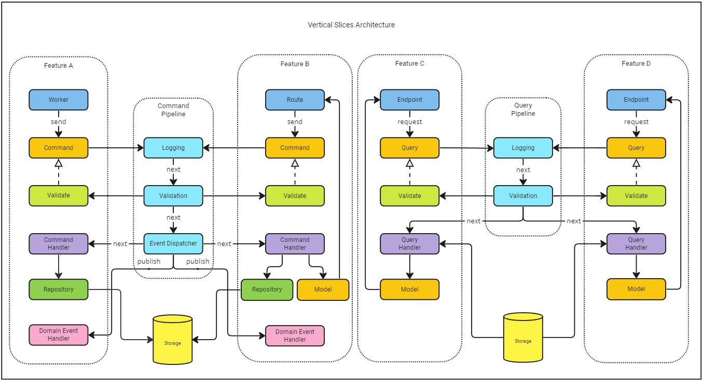

# Project Architecture

This repository adheres to the [community's recommended](https://github.com/golang-standards/project-layout/blob/master/README_ptBR.md) Go project layout and implements the Vertical Slice Architecture.

## `Makefile`

The `Makefile` contains commands to help you with your development workflow. Available commands are:

- `make infra`: Starts the `rabbitmq` and `mongodb` containers.
- `make up`: Launches the project in `Docker`, along with the connected infrastructure (`rabbitmq` and `mongodb`).
- `make down`: Stops and removes the associated containers (those started with either the `infra` or `up` command).
- `make rmi`: Deletes the application image from the local `Docker` repository.
- `make build`: Constructs the application `Docker` image in the local `Docker` repository.
- `make rmv`: Removes the `docker-compose` attached volumes.
- `make swag`: Generates the `Swagger` specifications in the `/api` directory.

## `/api`

The Swagger specifications (`docs.go`, `swagger.yaml`, and `swagger.json`) are generated by the `swaggo/swag` command line. Do not edit these files manually; instead, use the `swag` CLI to update them.

To generate the Swagger specifications into the `/api` directory, use the following command:

```bash
swag init -g ./cmd/main.go -o ./api
```

The `Makefile` already includes this command; you can invoke it using:

```bash
make swag
```

## `/build`

This directory is responsible for packaging and continuous integration. Our `Dockerfile` lives here.

## `/cmd`

The main application, `main.go`, resides here. Typically, each application should be placed in a directory matching the name of the desired executable (e.g., `/cmd/myapp`). However, since we're not shipping multiple applications within a single repository, you can place your `main.go` directly inside the `/cmd` directory.

_From the `project-layout`_:

> Don't put a lot of code in the application directory. If you think the code can be imported and used in other projects, then it should live in the `/pkg` directory. If the code is not reusable or if you don't want others to reuse it, put that code in the `/internal` directory. You'll be surprised what others will do, so be explicit about your intentions!

## `/config`

Configuration files such as `.env` files

_From the `project-layout`_:

> Put your `confd` or `consul-template` template files here.

## `/deployments`

This directory contains the `docker-compose.yml` file and the `kubernetes` scripts.

## `/docs`

Design and user documents (in addition to your godoc generated documentation).

## `/internal`

This is where the private application code resides. We structure our project using the Vertical Slice Architecture. Within the `/internal` directory, you should create a directory for each subdomain your application encompasses. Each subdomain should have its dedicated folder. Shared code between subdomains belongs in the `/internal/crosscutting` directory. The `/internal/app` directory houses code that imports the subdomains and orchestrates them into a unified application. This cohesive application will subsequently be imported into `/cmd/main.go`.

### `/internal/{subdomain}`

Typically, each subdomain contains the following directories:

#### `/internal/{subdomain}/domain`:

This is where _aggregates_, _entities_, _value objects_ (or _structs_), _domain events_, and _domain errors_ reside. With domain-driven design, most of the intensive work happens here. In anemic domain scenarios, your _entities_ (or _models_) also belong here.

#### `/internal/{subdomain}/features`:

We frequently employ `CQRS` using the _mediator_ pattern. Organizing _commands_ and _queries_ within a feature directory aids in structuring the code and sidestepping unintended side effects when altering shared logic, structs, or functions between features.

**Consequently, code from one feature should never import code from another feature.**

A feature's workflow initiates at the entrypoint, either an `HTTP` endpoint or a background `Worker`. This entrypoint dispatches the `Command/Query` to the respective `CommandHandler/QueryHandler`, producing an output `Model`. While working with `Commands`, generating an output `Model` or having a `DomainEventHandler` might be optional.

For adding validation to the `Command` or `Query`, one can implement the `Validatable` interface.

For `Commands`, a `Repository` can be fashioned to decouple persistence logic from the domain orchestration within the `CommandHandler`. When dealing with queries, one can directly connect to the chosen database and query data without invoking the domain.

Each feature should manage the registration of its dependencies in the dependency injection container. It should expose a `Configure(*dig.Container)` function, which will be invoked by the `/internal/{subdomain}/ioc` module.

When using an `HTTP` endpoint as the entrypoint, the feature should expose a `gin.HandlerFunc` to be mapped onto the Router by the `/internal/{subdomain}/routes` module.

If a background `Worker` serves as the entrypoint, the feature should provide the `Worker` so that it can be added to the `Host`'s collection of workers by the `/internal/{subdomain}/work` module.

Given that features reside in separate directories (each corresponding to a `Go module`), the module's name can hint at the feature in question. This allows for the _structs_ and _interfaces_ within the feature to have concise names, such as: `Command`, `Query`, `CommandHandler`, `QueryHandler` `Model`, `Repository`, and so forth.



#### `/internal/{subdomain}/infrastructure`

This directory is designated for storing shared implementations of `IO` operations, such as HTTP Clients, database migrations, AWS S3 clients, and more.

#### `/internal/{subdomain}/ioc`

This directory, also a `Go` module, is responsible for orchestrating and invoking all the dependency injection configurations for the features. The `/internal/app/ioc` module invokes it.

#### `/internal/{subdomain}/routes`

This directory, also a `Go` module, is responsible for orchestrating and mapping all feature endpoints, given a `Router` or a `RouterGroup`. The `/internal/app/routes` module invokes it.

#### `/internal/{subdomain}/work`

This directory, also a `Go` module, is responsible for orchestrating and configuring all feature workers, returning a `slice` of Workers. The `/internal/app/work` module invokes it.

### `/internal/app`

This directory is responsible for consolidating modules to orchestrate all subdomains, combining them into a unified application by:

- Providing and configuring a single `Router` for consumption by the `Host`, which may also create and manage `RouterGroups`.
- Aggregating all subdomain worker slices into one comprehensive slice for the `Host`.
- Offering either a single or multiple dependency injection containers to each subdomain.

### `/internal/crosscutting`

This directory is responsible for housing modules shared among the `/internal/{subdomain}/features` and `internal/app` modules. It's important to note that in terms of control flow, these modules should be the ones imported and they should not import code from the `/internal/{subdomain}/features` or `internal/app` modules.

## `/pkg`

This directory contains public code that external applications can import. Generally, we won't utilize this directory unless we're experimenting with new packages or testing/improving the behavior of an existing library by cloning its code into the repository. We can then use a `go.work` file to operate with the local version of that library.

Both `/pkg/messaging` and `/pkg/hosting` are potential library candidates and are yet to be published on [GitHub](https://github.com/mitz-it)..
