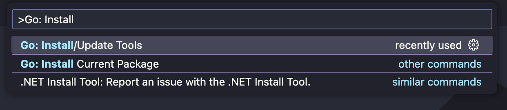
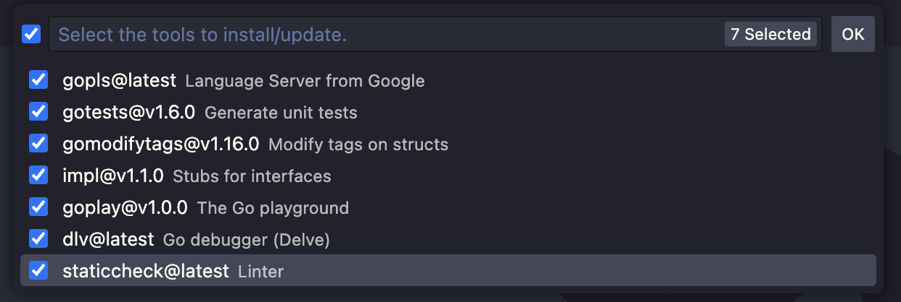

# Environment Setup

This repository uses `Go` at version `1.24.1` and `Docker`.

To install `Docker`, please head to the [official Docker documentation](https://docs.docker.com/get-docker/)

Use the `Makefile` to execute common development scripts.

## Installing Go

- Option 1: You can download the `1.24.1` version and follow the [official Go documentation](https://go.dev/doc/install).
- Option 2: You can use `ASDF` to manage programming languages versions with a single command line interface.

We **strongly** recommend that you go with option 2 if you are a _Linux/macOS_ user and option 1 if you are a _Windows_ user, although the _Linux_ setup can be achieved with _WSL 2_.

### ASDF

`ASDF` is a tool version manager which provides a single interface and configuration file to simplify development workflows, and can be extended to all tools and runtimes via a simple plugin interface.

You can find the complete download and installation instructions [here](https://asdf-vm.com/guide/getting-started.html), but for most users the following instructions are enough to download and install `ASDF`. If facing any problem, please, read the documentation and contact us for assistance.

#### Linux

To download `ASDF` paste the following command into your terminal, preferably in your `$HOME` directory:

```bash
git clone https://github.com/asdf-vm/asdf.git ~/.asdf --branch v0.14.0
```

_At the time of writing this documentation, `ASDF` is at version 0.14.0. Please check the current version [here](https://asdf-vm.com/guide/getting-started.html#official-download)._

If you already has `ASDF` installed, you can update it by checking out the `.asdf` repository folder to the new tag.

```bash
git fetch origin refs/tags/<VERSION> && git checkout tags/<VERSION>
```

To install `ASDF` paste the following command into your shell profile file like `.bashrc` or `.zshrc`:

```bash
. "$HOME/.asdf/asdf.sh"
. "$HOME/.asdf/completions/asdf.bash"
```

#### Notes about ASDF

- `ASDF` scripts need to be sourced after you have set your `$PATH` and after you have sourced your framework (oh-my-zsh etc).

- On _macOS_, starting a `Bash` or `Zsh shell` automatically calls a utility called `path_helper`. `path_helper` can rearrange items in `PATH` (and `MANPATH`), causing inconsistent behavior for tools that require specific ordering. To workaround this, `ASDF` on _macOS_ defaults to forcily adding its `PATH`-entries to the front (taking highest priority). This is controllable with the `ASDF_FORCE_PREPEND` variable.

- Verify your `ASDF` installation by opening a new terminal window and running:

```bash
asdf --version
```

### Installing Go with ASDF

Paste the following commands into your terminal:

```bash
asdf plugin add golang https://github.com/asdf-community/asdf-golang.git && \
  asdf install golang 1.24.1 && \
  asdf global golang 1.24.1
```

Your shell profile (`~/.bashrc`, `~/.bash_profile`, `~/.zshrc`, etc., depending on your shell) should look like this:

```bash
export ASDF=$HOME/.asdf

. $ASDF/asdf.sh
. ~/.asdf/plugins/golang/set-env.zsh

# Add this lines when in linux/WSL2 uncomment:
. $ASDF/completions/asdf.bash

# Add these lines when in MacOS M1/M2/M3:
fpath=(${ASDF}/completions $fpath)
autoload -Uz compinit && compinit

export GOPATH=$GOROOT/packages
# Add this line when in MacOS M1/M2/M3,
# If using Linux os Windows, check your platform
# to set this environment variable.
export GOTOOLDIR=$GOROOT/pkg/tool/darwin_arm

export PATH=$PATH:`go env GOPATH`/bin
```

Reload your shell by closing and open a new terminal window (the `source` command can also be used.)

```shell
# Check if your profile uses: .bashrc, .zshrc or whatever...
source ~/.zshrc
```

Verify your `Go` installation with:

```bash
go version
```

It is recommended to close and open VS Code after changing the `Go` environment variables in the profile file.

If not present, install the `Go` extension by the **Go Team at Google** to VS code.

Install/Update the `Go` development tools, by opening the VS code command palette (`F1` / `Cmd + Shift + P` / `Ctrl + Shift + P`), and searching for: **"Go: Install/Update Tools"**. Then, select all tools and click **"OK"**.



